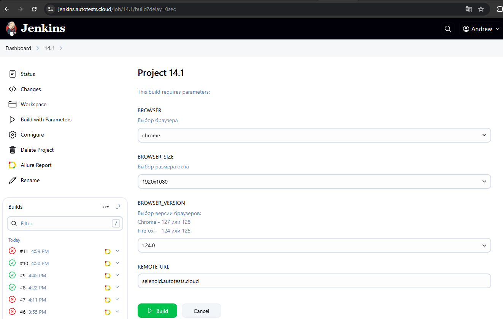
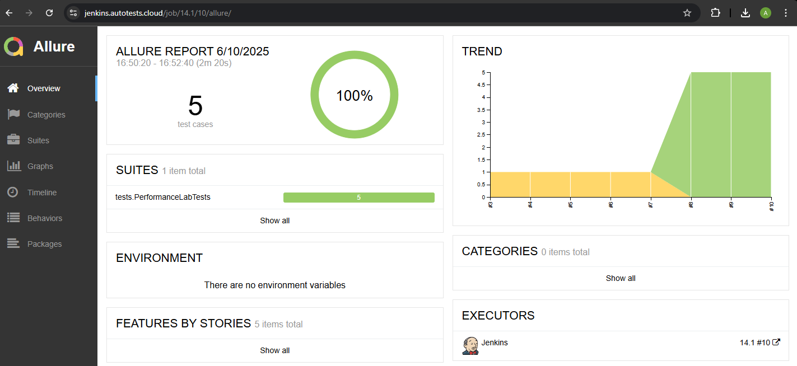
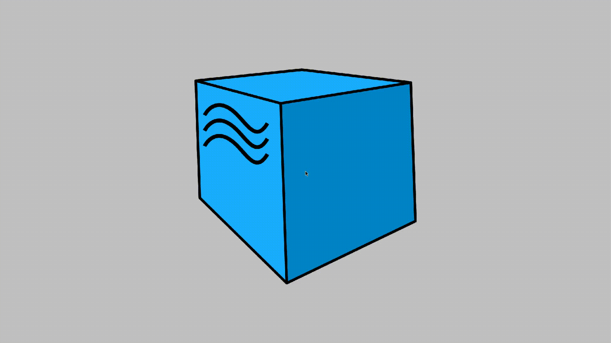
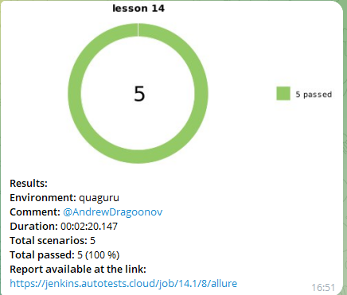

# Проект по автоматизации тестовых сценариев для сайта компании [Перфоманс Лаб](https://www.performance-lab.ru/)
---

## Технологии и инструменты

- Java
- Selenide
- Selenoid
- JUnit 5
- Gradle
- Jenkins
- Allure Report
- Telegram Bot

---

## Запуск тестов

### Запуск тестов из терминала

Команда для запуска теста:  
`gradle clean PerformanceLabTests`  
Команда для запуска теста с параметрами:  
`gradle clean PerformanceLabTests -Dbrowser=chrome -Dversion=100 -Dsize=1920x1080`
---

### Jenkins

Запустить [тест](https://jenkins.autotests.cloud/job/14.1/) можно в Jenkins.
Для этого необходимо кликнуть по кнопке **Build with Parameters**, после чего
выбрать параметры и нажать кнопку **Build**

---

## Allure отчет

После прохождения
теста [отчёт](https://jenkins.autotests.cloud/job/14.1/10/allure/) выгружается в
**build/allure-results**

К каждому отчёту о тестировании автоматически создаются скриншоты, видео, логи и
копия странички  
Пример
видео 
---

## Уведомления в Telegram с помощью бота

После завершения сборки телеграм бот уведомляет о результатах прохождения теста.
Бот может тегать нужных участников чата
